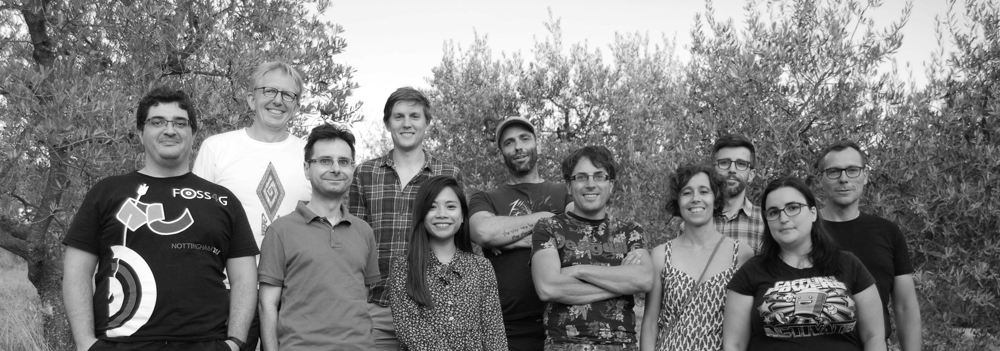
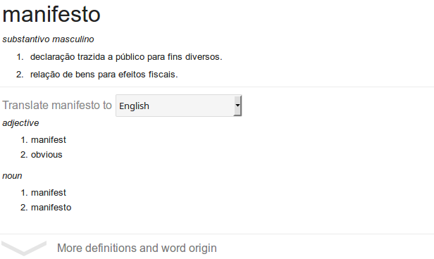

# Micro-services through Docker
### Tales from a Journey

+++

+++

## Introduction

+ Micro-company, based in the NL
+ Spatial Data Infrastructures (SDI)
+ FOSS

---

TODO: use case

---

# Why Microservices?

---

# Why Docker?

+++

# The System

+++

# Highlights

---

# Managing Starting Order

---

# Sharing and Persisting Data

---

# Container Communication

---

# Development and Production Configurations

+++

# Challenges

---

## Riding on the crest of the Wave

---

## Distributed Development

### " No matter what the problem is, it's always a people problem "
Gerald M. Weinberg

---

## Trusting a Third Party

+++

# Final Thoughts

+++

# Thank You!
## Questions?

* twitter -> @doublebyte
* github -> @doublebyte1
* blog -> doublebyte.net

<!--

+ gvSIG
+ uDig <!-- .element: class="fragment" -->
<!-- + openJUMP <!-- .element: class="fragment" -->
<!-- + Saga GIS <!-- .element: class="fragment" -->
<!-- + PostreSQL + PostGIS <!-- .element: class="fragment" -->
<!-- + Spatialite <!-- .element: class="fragment" -->
<!-- + entre outros <!-- .element: class="fragment" -->
