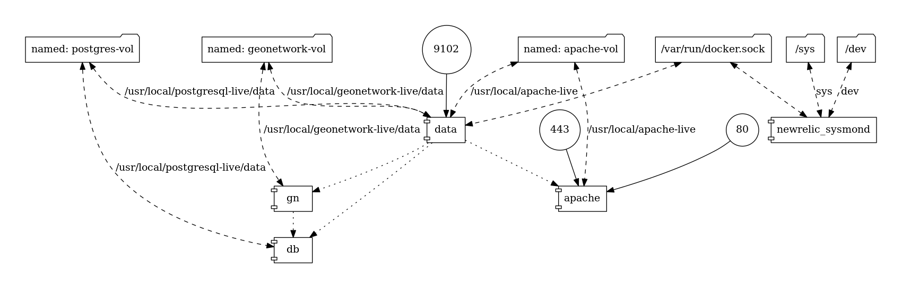

# Micro-services through Docker
### Tales from a Journey

+++?image=assets/journey.jpg&size=auto 90%

---

## Introduction

+ Micro-company, based in the NL
+ Spatial Data Infrastructures (SDI)
+ FOSS


---
## SDI


<!-- data infrastructure implementing a framework of geographic data, metadata, users and tools that are interactively connected in order to use spatial data in an efficient and flexible way
 -->

---?image=assets/artisan.jpg
<!-- .slide: data-background-transition="none" -->
---?image=assets/artisan2.jpg
<!-- .slide: data-background-transition="none" -->
---?image=assets/Docker-Security.jpg&size=auto 90%

---
## Why Docker?

- Automation  |
- Portability |
- Scalability |

<!--
Infrastructure as code
Build once, ship anywhere
- Rapid deployment
- Portability across machines
- Modularity
-->

+++
## SDI



+++

## SDI as-a-Service
- Create and manage customer orders
- Deploy and mananage servers
- Transform software assets into images
- Deploy and manage orchestrations
- Link customer orders to servers/orchestrations

+++?image=assets/virtualization_before.jpg

---
## Why Microservices?
- Isolation |
- Simplicity |
- Scalability |

<!--
A failure of a component does not affect the entire System
easier upgrades; we can combine multiple technologies
Its easier to understand single components; scalability

Microservices is an architecture which breaks large software projects into loosely coupled modules, which communicate with each other through REST APIs.
-->

+++

## The System


+++?image=assets/matrioska.jpg

+++

## Stack
- Docker Engine, Docker-compose, Docker-machine
- Spring Boot, Spring Cloud
- Flask, Swagger
- Jenkins, Nexus

---

## Docker for Microservices
### Hightlights
---

## Managing Starting Order
### when dependence is not enough
+++
### Wait-for-it

```bash
#!/usr/bin/env bash
#   Use this script to test if a given TCP host/port are available

cmdname=$(basename $0)

echoerr() { if [[ $QUIET -ne 1 ]]; then echo "$@" 1>&2; fi }

usage()
{
    cat << USAGE >&2
Usage:
    $cmdname host:port [-s] [-t timeout] [-- command args]
    -h HOST | --host=HOST       Host or IP under test
    -p PORT | --port=PORT       TCP port under test
                                Alternatively, you specify the host and port as host:port
    -s | --strict               Only execute subcommand if the test succeeds
    -q | --quiet                Don't output any status messages
    -t TIMEOUT | --timeout=TIMEOUT
                                Timeout in seconds, zero for no timeout
    -- COMMAND ARGS             Execute command with args after the test finishes
USAGE
    exit 1
}

wait_for()
{
    if [[ $TIMEOUT -gt 0 ]]; then
        echoerr "$cmdname: waiting $TIMEOUT seconds for $HOST:$PORT"
    else
        echoerr "$cmdname: waiting for $HOST:$PORT without a timeout"
    fi
    start_ts=$(date +%s)
    while :
    do
        if [[ $ISBUSY -eq 1 ]]; then
            nc -z $HOST $PORT
            result=$?
        else
            (echo > /dev/tcp/$HOST/$PORT) >/dev/null 2>&1
            result=$?
        fi
        if [[ $result -eq 0 ]]; then
            end_ts=$(date +%s)
            echoerr "$cmdname: $HOST:$PORT is available after $((end_ts - start_ts)) seconds"
            break
        fi
        sleep 1
    done
    return $result
}

wait_for_wrapper()
{
    # In order to support SIGINT during timeout: http://unix.stackexchange.com/a/57692
    if [[ $QUIET -eq 1 ]]; then
        timeout $BUSYTIMEFLAG $TIMEOUT $0 --quiet --child --host=$HOST --port=$PORT --timeout=$TIMEOUT &
    else
        timeout $BUSYTIMEFLAG $TIMEOUT $0 --child --host=$HOST --port=$PORT --timeout=$TIMEOUT &
    fi
    PID=$!
    trap "kill -INT -$PID" INT
    wait $PID
    RESULT=$?
    if [[ $RESULT -ne 0 ]]; then
        echoerr "$cmdname: timeout occurred after waiting $TIMEOUT seconds for $HOST:$PORT"
    fi
    return $RESULT
}

# process arguments
while [[ $# -gt 0 ]]
do
    case "$1" in
        *:* )
        hostport=(${1//:/ })
        HOST=${hostport[0]}
        PORT=${hostport[1]}
        shift 1
        ;;
        --child)
        CHILD=1
        shift 1
        ;;
        -q | --quiet)
        QUIET=1
        shift 1
        ;;
        -s | --strict)
        STRICT=1
        shift 1
        ;;
        -h)
        HOST="$2"
        if [[ $HOST == "" ]]; then break; fi
        shift 2
        ;;
        --host=*)
        HOST="${1#*=}"
        shift 1
        ;;
        -p)
        PORT="$2"
        if [[ $PORT == "" ]]; then break; fi
        shift 2
        ;;
        --port=*)
        PORT="${1#*=}"
        shift 1
        ;;
        -t)
        TIMEOUT="$2"
        if [[ $TIMEOUT == "" ]]; then break; fi
        shift 2
        ;;
        --timeout=*)
        TIMEOUT="${1#*=}"
        shift 1
        ;;
        --)
        shift
        CLI=("$@")
        break
        ;;
        --help)
        usage
        ;;
        *)
        echoerr "Unknown argument: $1"
        usage
        ;;
    esac
done

if [[ "$HOST" == "" || "$PORT" == "" ]]; then
    echoerr "Error: you need to provide a host and port to test."
    usage
fi

TIMEOUT=${TIMEOUT:-15}
STRICT=${STRICT:-0}
CHILD=${CHILD:-0}
QUIET=${QUIET:-0}

# check to see if timeout is from busybox?
# check to see if timeout is from busybox?
TIMEOUT_PATH=$(realpath $(which timeout))
if [[ $TIMEOUT_PATH =~ "busybox" ]]; then
        ISBUSY=1
        BUSYTIMEFLAG="-t"
else
        ISBUSY=0
        BUSYTIMEFLAG=""
fi

if [[ $CHILD -gt 0 ]]; then
    wait_for
    RESULT=$?
    exit $RESULT
else
    if [[ $TIMEOUT -gt 0 ]]; then
        wait_for_wrapper
        RESULT=$?
    else
        wait_for
        RESULT=$?
    fi
fi

if [[ $CLI != "" ]]; then
    if [[ $RESULT -ne 0 && $STRICT -eq 1 ]]; then
        echoerr "$cmdname: strict mode, refusing to execute subprocess"
        exit $RESULT
    fi
    exec "${CLI[@]}"
else
    exit $RESULT
fi
```
https://github.com/vishnubob/wait-for-it
<!-- Pure bash script to test and wait on the availability of a TCP host and port -->
---

## Sharing and Persisting Data
### in a world of ephemeral containers
+++

### Named volumes
- Easy to backup
- Shared among containers

https://docs.docker.com/engine/admin/volumes/volumes/

<!-- work on different OS; not bind volumes; other patterns -->
---

## Container Communication
### through docker networking
+++
## Resolving IP Adresses
- User-defined networks
- Legacy "Link"

<!--
If you want containers to be able to resolve IP addresses by container name, you should use user-defined networks instead
-->

https://docs.docker.com/engine/userguide/networking/#user-defined-networks

---
## Development and Production Configurations
### <span style="color:#e49436">"</span> Develop once, deploy everywhere. <span style="color:#e49436">"
+++

## Multiple Compose Files
### Adding and overriding configuration.

https://docs.docker.com/compose/extends/

---

# Challenges

---?image=assets/wave.jpg

## <span style="color:#e49436"> Riding on the crest of the Wave </span>

---

## Distributed Development

### <span style="color:#e49436">"</span> No matter what the problem is, it's always a people problem <span style="color:#e49436">"
<span style="font-size:0.6em; color:gray">Gerald M. Weinberg</span>

---

## Trusting a Third Party


+++?image=assets/journey.jpg&size=auto 90%

---

# Thank You!
## I would love to hear your thoughts

* twitter -> @doublebyte
* github -> @doublebyte1
* blog -> doublebyte.net
