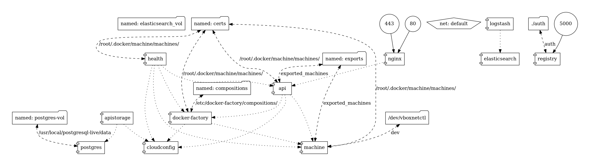

# Micro-services through Docker
### Tales from a Journey

+++?image=assets/journey.jpg&size=auto 90%

+++

## Introduction

+ Micro-company, based in the NL
+ Spatial Data Infrastructures (SDI)
+ FOSS

---
## SDI

<!-- data infrastructure implementing a framework of geographic data, metadata, users and tools that are interactively connected in order to use spatial data in an efficient and flexible way
 -->

---?image=assets/artisan.jpg

---?image=assets/Docker-Security.jpg&size=auto 90%

---

## Why Docker?

- Automation  |
- Portability |
- Scalability |

<!--
Infrastructure as code
Build once, ship anywhere
- Rapid deployment
- Portability across machines
- Modularity
-->

---
## SDI

---

## SDI as a Service
- Create and manage customer orders
- Deploy and mananage servers
- Transform software assets into images
- Deploy and manage orchestrations
- Link customer orders to servers/orchestrations

---?image=assets/virtualization_before.jpg&size=auto 90%

## Why Microservices?

+++

# The System

+++

# Highlights

---

# Managing Starting Order

---

# Sharing and Persisting Data

---

# Container Communication

---

# Development and Production Configurations

+++

# Challenges

---

## Riding on the crest of the Wave

---

## Distributed Development

### " No matter what the problem is, it's always a people problem "
Gerald M. Weinberg

---

## Trusting a Third Party

+++

# Final Thoughts

+++

# Thank You!
## Questions?

* twitter -> @doublebyte
* github -> @doublebyte1
* blog -> doublebyte.net

<!--

+ gvSIG
+ uDig <!-- .element: class="fragment" -->
<!-- + openJUMP <!-- .element: class="fragment" -->
<!-- + Saga GIS <!-- .element: class="fragment" -->
<!-- + PostreSQL + PostGIS <!-- .element: class="fragment" -->
<!-- + Spatialite <!-- .element: class="fragment" -->
<!-- + entre outros <!-- .element: class="fragment" -->
